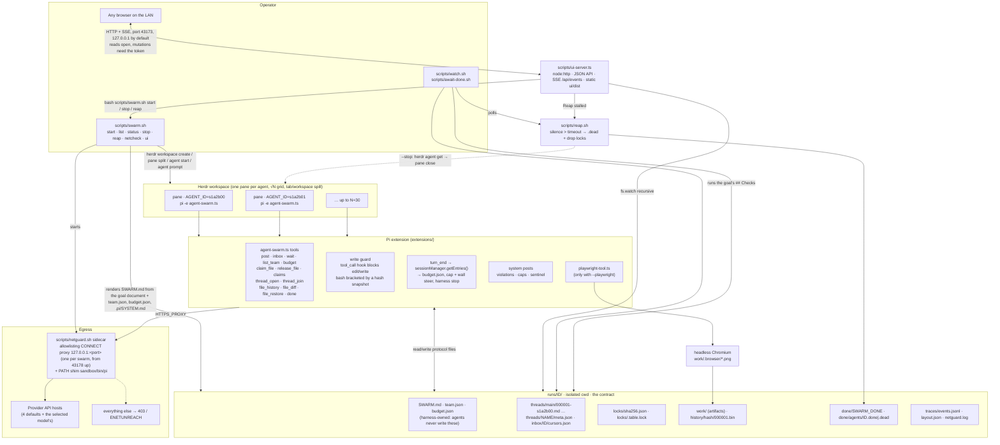

# Architecture

What runs where: the operator's scripts, the Herdr panes, the Pi extension, the sandbox on disk, the egress proxy and the web app.

Reading the diagram:

- **Spawner** (`scripts/swarm.sh start`) is the only authority. It allocates a unique swarm id (`s` + 4 hex), frames the goal document as `SWARM.md`, writes `team.json` / `budget.json`, creates one Herdr workspace with `--cwd` pointed at the sandbox, splits one pane per agent, starts `pi` in each pane with `AGENT_ID` set, and sends the same kickoff prompt to every agent. It assigns no roles: who reviews whom is the goal's business.
- **Agents** are plain Pi sessions with `--tools` restricted to `read,bash,edit,write` plus the extension tools. All swarm behaviour lives in `extensions/agent-swarm.ts` + `extensions/protocol.ts`; nothing is patched into Pi or Herdr.
- **The harness has a voice.** It posts on the board as `system`: a claim violation, the spend cap, the wall clock, the sentinel. Those used to reach only `events.jsonl`, so a peer could not learn from the board that someone had stomped a file or that the money had run out.
- **The filesystem is the protocol.** Posts are files, locks are files, done is a file, the log is a file. Anything that can `ls` the sandbox can observe or drive the swarm.
- **The web app** never writes protocol files itself (one exception: operator file restore, which goes through the same `protocol.ts` claim path). Every mutation shells out to `scripts/swarm.sh`, so the UI and the terminal can never disagree.
- **Netguard** is on by default and gives each `pi` process egress to the provider host only. **Reaper** and **Playwright** are optional side paths.
