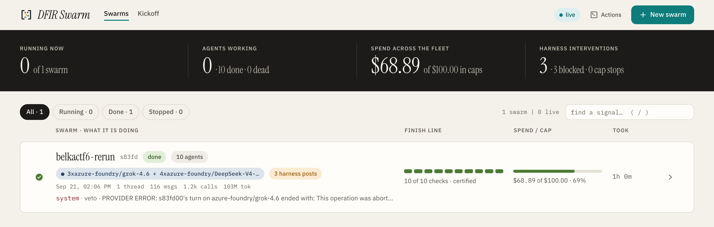
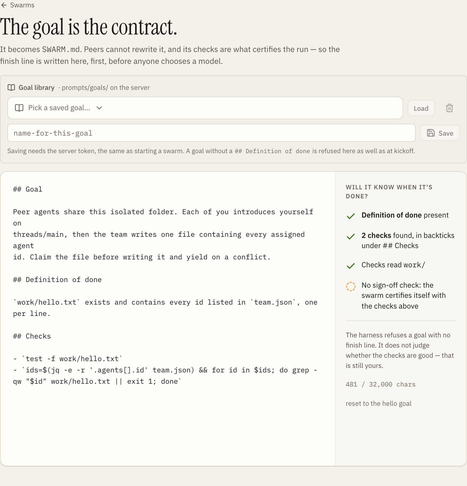
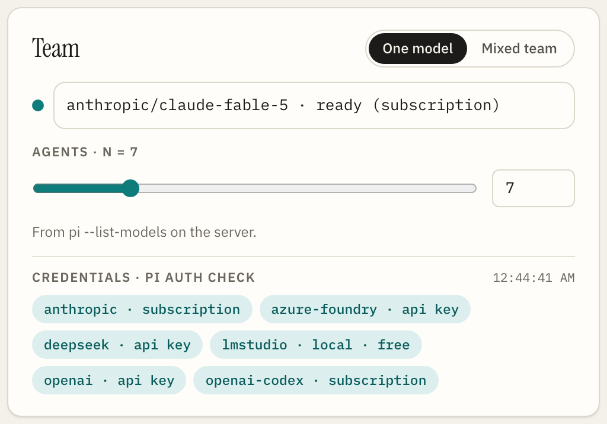
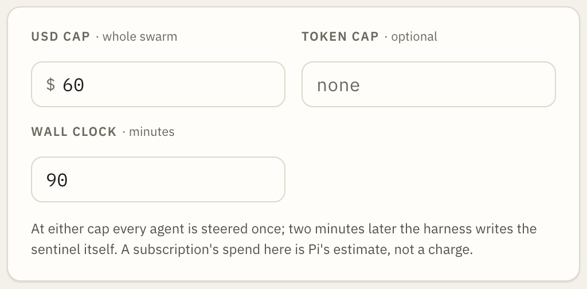
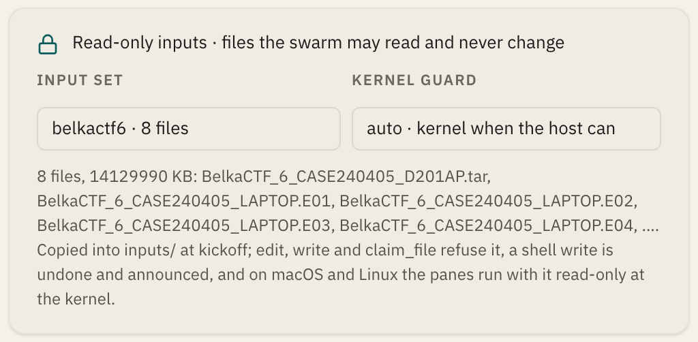
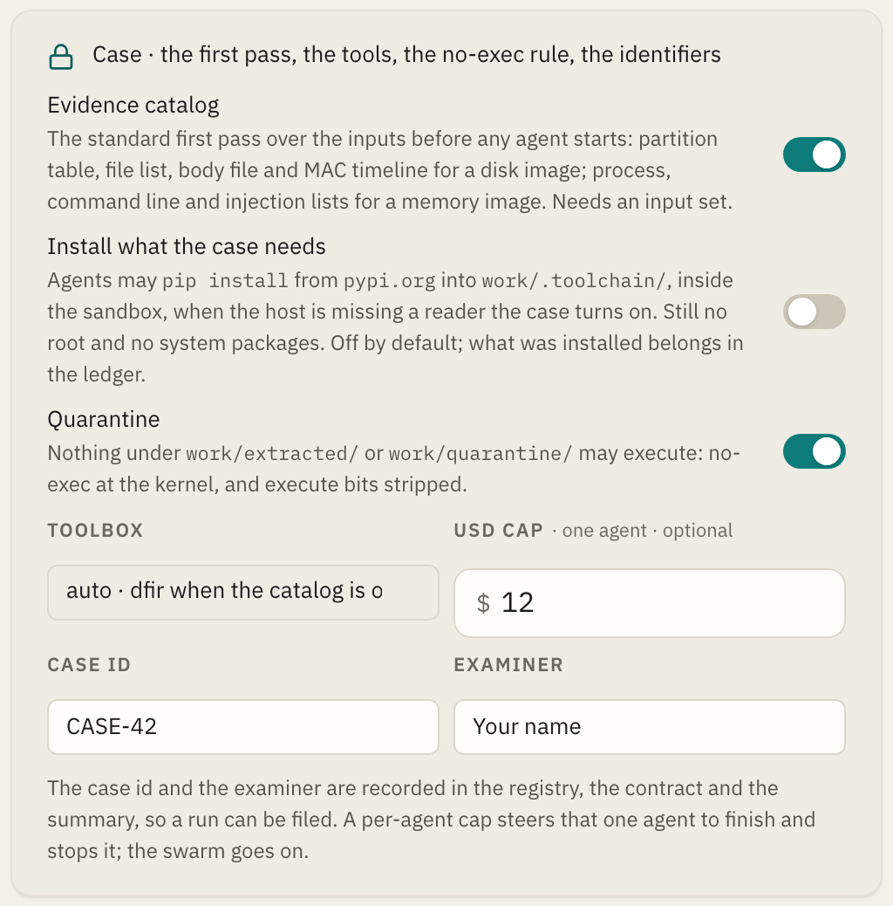
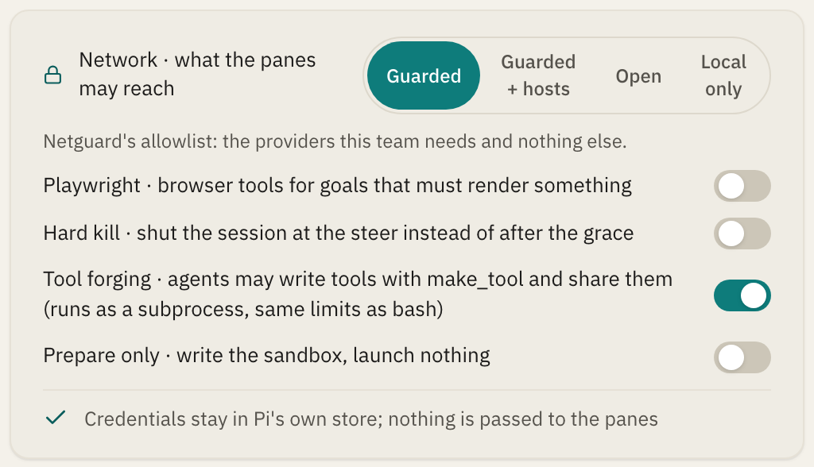
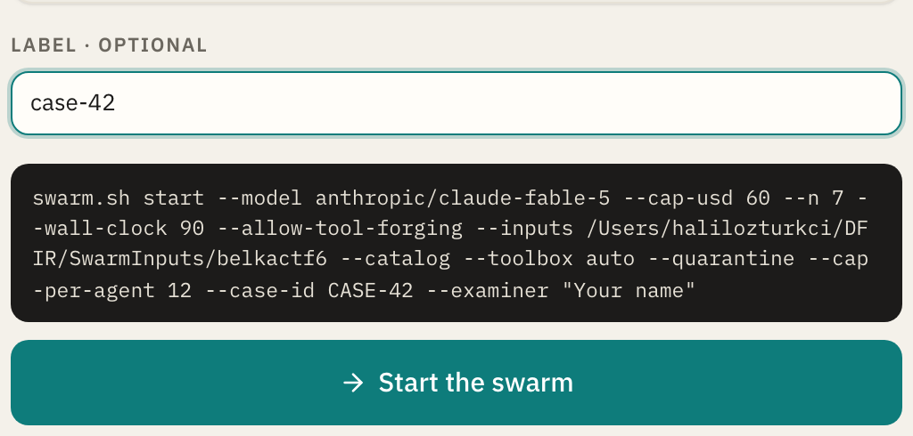

# Quick start

From a clean machine to a first live swarm, the console, and a first case:
prerequisites, install, the dry run with no model, the proof runs with no
key, the first live N=2, the web console, and what a real case needs on the
command line. About five minutes if Herdr and Pi are already installed.

### Prerequisites

| Need | Why | Check |
| --- | --- | --- |
| **Node ≥ 22.6** | `--experimental-strip-types` runs the `.ts` scripts and tests without a build step. Node ≥ 22.21 (or 24) is needed for `NODE_USE_ENV_PROXY` if your `pi` is a Node build (see [Safety](safety.md)). | `node --version` |
| **bash 4+, jq 1.6+, python3, curl; zsh if it is the login shell** | `swarm.sh` renders the contract with python3 and manages the registry with jq; the pane hook runs in the login shell, which has to be zsh or bash; `netcheck` uses curl. | `jq --version && python3 --version && getent passwd "$(id -un)" \| cut -d: -f7` |
| **Herdr** | Panes, workspaces, `herdr agent start --kind pi`. Live runs used Herdr 0.9.0. There is **no** `herdr swarm` command; do not install `pi-herdsman`, `pi-herdr` or `@gjczone/pi-swarm` expecting this demo. | `herdr --version` |
| **Pi** (`@earendil-works/pi-coding-agent`) | The agent harness. Verified against 0.85.1; the extension APIs it uses date from 0.74. | `pi --version` |
| **A provider login for Pi** | `pi /login` once: an API key **or a Claude / ChatGPT subscription**; see [Credentials](usage.md#credentials). `swarm.sh start` passes no credential to the panes; Pi reads its own store. On a host with no persistent home, export the key and pass `--key-from-env` instead (see [ADR 0003](adr/0003-the-provider-key-comes-from-pis-own-store.md)). | `pi auth check --model <provider/id>` |
| **A kernel guard** | macOS has `sandbox-exec` built in. On Linux the write allowlist and the clean room need Landlock (kernel 5.13+, `python3`), and the socket mask and the fail-closed egress guard need unprivileged user namespaces (`unshare -rm`, `unshare -rn`); bubblewrap adds a read-only root when present. The kickoff measures what the host has and records it, so a host that lacks one still runs, and the record says so. | `unshare -rn true`; `python3 scripts/landlock.py --dry-run -- true` |
| Optional: Chromium | `--playwright` tool. `npx playwright install chromium`, or point `BROWSER_CHECK_EXECUTABLE` at an installed Chrome. | |

### Install

```bash
# Herdr + its Pi integration
curl -fsSL https://herdr.dev/install.sh | sh
herdr integration install pi

# Pi
npm install -g --ignore-scripts @earendil-works/pi-coding-agent
# or: curl -fsSL https://pi.dev/install.sh | sh

# This repo (only needed for the web app bundle, typecheck, and the Playwright tool)
git clone https://github.com/halilozturkci/dfirswarm && cd dfirswarm
npm install
```

### 1. Dry run without a model (no keys, no Herdr, no network)

```bash
npm test
# = node --experimental-strip-types --test tests/dry-run.test.ts tests/ui-server.test.ts ...
```

The protocol test alone runs with nothing but Node:

```bash
node --experimental-strip-types --test tests/dry-run.test.ts
npm run test:bash    # await-done certification, the reaper, netguard, the guards this host has
```

Two fake workers post on the board, hit a claim conflict, get a write blocked
without a lease (recorded as `claim_violation`), have a shell write detected
and announced, fold fake Pi usage into `budget.json`, write `work/hello.txt`
with both ids, and stop on `done/SWARM_DONE`. The bash fixtures cover the part
that decides whether a run counts as finished, and the guard suites skip
themselves with a message on a host that cannot enforce a guard.

### 1b. A whole swarm without a key (real panes, scripted model)

Fixtures never touch Pi's hooks or Herdr's panes. To exercise those without
paying for tokens, point Pi at a local scripted provider:

```bash
node tests/mock-provider.mjs --port 8787 \
     --script tests/fixtures/mock-swarm-hello.mjs &

scripts/swarm.sh start --model mockswarm/scripted-1 --n 2 \
  --cap-usd 5 --no-netguard --goal-file prompts/goals/hello.md \
  --env PI_CODING_AGENT_DIR=/tmp/piagent
```

`/tmp/piagent/models.json` declares the provider; the full file and the results
are in [docs/proof-run.md](proof-run.md). Everything but the model is real,
which is enough to watch a claim conflict happen between two live processes and
to watch the harness write `done/SWARM_DONE` itself when the agents ignore a cap.

### 1c. A whole swarm on a local model, for nothing

The same run on a model served from this machine costs nothing and needs no
login. With Ollama running and a model pulled, give Pi's `models.json` a
provider with a placeholder key and a `compat` block (the full file, and why
each line matters, is in
[credentials-and-teams.md](credentials-and-teams.md#local-models-ollama-lm-studio-vllm-llamacpp)),
then:

```bash
scripts/swarm.sh start --model ollama/glm-4.7-flash-64k:latest --n 2 \
  --cap-tokens 3000000 --wall-clock 12 --local-only \
  --goal-file prompts/goals/hello.md
```

A team that bills nothing cannot be stopped by `--cap-usd`, so the kickoff
asks for a token cap instead, probes the server before any pane opens (that
it answers, that it has the model, what context Ollama will really give),
and runs netguard with the local endpoint as the only allowed host. The run
this was proven on (`s7f9d`, two agents, 2/2 checks in 8m 50s, 157,803
tokens, $0, three `ALLOW connect 127.0.0.1:11434` and no DENY in the netguard
log) is in [verified-runs.md](verified-runs.md). The summary and the console
then say "free" and count tokens against the cap rather than "$0.00 spent".

### 2. First live run, N=2

Herdr must be running before kickoff: open the Herdr app, or in a second terminal run `herdr server` (`swarm.sh` talks to it over the socket and does not start it for you). Make sure `herdr` is on `PATH` (`export PATH="$HOME/.local/bin:$PATH"` after the installer).

```bash
pi /login                            # once; swarm.sh does not pass keys to panes
scripts/swarm.sh netcheck            # optional: proves provider ALLOW / example.com DENY

scripts/swarm.sh start \
  --model deepseek/deepseek-v4-pro \
  --cap-usd 1 \
  --n 2 \
  --goal-file prompts/goals/hello.md
```

`--goal-file` is where you say what the swarm is for. It is a markdown
document that must carry its own `## Definition of done`; the `## Checks` lines
in it are what `await-done.sh` runs to decide whether the run actually
finished. A goal without a definition of done does not start; see
[Writing a goal](usage.md#writing-a-goal).

Output ends with the swarm id, the sandbox path, the three commands to watch,
check status and stop, and a line per guard saying what this host could
enforce. Read those lines once: on macOS the write guard, the evidence guard
and the quarantine are kernel-enforced (seatbelt) and the egress guard is a
proxy the panes are pointed at, which is advisory; on Linux the egress guard
is a network namespace with no other route out, and the write guard is
Landlock, inside a user namespace where the host allows one. The same facts
go into the run record and the report's custody section. Then:

```bash
scripts/swarm.sh list
scripts/swarm.sh status <id>
SWARM_SANDBOX=runs/<id> scripts/watch.sh
scripts/await-done.sh --sandbox runs/<id>     # exit 0 once the DoD is met
scripts/swarm.sh stop <id>
```

A live N=2 hello run costs about **$0.02–0.06** on DeepSeek V4 Pro and finishes in one to two minutes ([Verified results](verified-runs.md)).

### 3. Open the web console on the LAN

```bash
npm run ui:build                     # once; swarm.sh ui also builds when ui/dist is missing
scripts/swarm.sh ui                  # http://<this-machine-ip>:43173 (SWARM_UI_PORT changes it)
```

Binds `0.0.0.0`, LAN only by design. **Watching is open; starting, stopping,
reaping and restoring need a token.** The server mints one at startup and
prints it in the URL it hosts (in the fragment, so it never reaches a proxy
log); open that URL once and the browser keeps it. `SWARM_UI_TOKEN=...` pins
your own, and `SWARM_UI_TOKEN=` (empty) turns the check off deliberately.

Swarms started from the terminal appear instantly; the **New swarm** form
starts them through the same `swarm.sh`, with the goal document first and its
finish line read back before a model is chosen. To browse the console without
a model: `npm run ui:fixture` then `SWARM_RUNS_DIR=$PWD/runs-fixture scripts/swarm.sh ui`.

### 3b. Or start it from the console

The **New swarm** form takes everything the command line takes and runs the
same `swarm.sh start` underneath. In the order the form asks, on a first case:

| | |
| --- | --- |
|  |  |
| **1. New swarm.** The overview lists every run in this registry; the button in the header opens the kickoff. | **2. The goal.** Write it or load a saved one; the panel beside it reads the finish line back (definition of done, the checks found, whether they read `work/`). A goal without a finish line is refused here too. |
|  |  |
| **3. The team.** One model or a mixed team with a count per model; the chips are what `pi auth check` answered for each provider right now. | **4. The caps.** A dollar cap for the swarm, a token cap (required for a team of local models), the wall clock. |
|  |  |
| **5. The evidence.** Sets under `SWARM_INPUTS_ROOT`, with file count and size; *auto* takes the kernel guard the host has. | **6. The case.** Catalog first pass, install, quarantine, the toolbox, a per-agent cap, the case id and the examiner. |
|  |  |
| **7. The network and the switches.** Guarded by default; hosts a case needs; local-only; browser tools, hard kill, tool writing, prepare only. | **8. The command, then Start.** The form shows the exact `swarm.sh start` line it will run. Starting needs the token from the server's startup line; watching never does. |

### 4. Your first case

A case differs from the hello goal in three ways: evidence, a real goal
document, and the tools the agents will need. The flags below are the ones
every published case ran with; `swarm.sh help start` explains each.

```bash
scripts/swarm.sh start \
  --models "openai/gpt-5.4=4,deepseek/deepseek-v4-pro=3" --n 7 \
  --goal-file goals/case-42.md \
  --inputs /evidence/case-42 \          # copied in, hashed, read-only at the kernel
  --catalog --toolbox dfir --quarantine \
  --allow-tool-forging \
  --cap-usd 60 --cap-per-agent 12 --wall-clock 90 \
  --case-id CASE-42 --examiner "Your name" --label case-42
```

- **Evidence.** `--inputs DIR` copies the directory into the run, hashes every
  file, and holds it read-only in every pane. For evidence too large to copy,
  `--inputs-bind` guards the source directory in place; on macOS
  `--inputs-image case.dmg` attaches a disk image read-only. Nothing the
  agents extract from it can execute under `--quarantine`.
- **The goal.** Copy a published one and change the questions: a case goal
  carries the questions, a `## Definition of done` that names the report and
  the ledger, and `## Checks` the agents cannot edit. The BelkaCTF goal is a
  complete example:
  [docs/use-cases/belkactf/belkactf6-bogus-bill/goal.md](use-cases/belkactf/belkactf6-bogus-bill/goal.md).
- **Tools.** `--toolbox dfir` checks the host for Sleuth Kit, libewf, libbde,
  Volatility, YARA and the parsers a case needs and names what is missing
  before the first agent starts; `--catalog` runs the first pass over the image
  once, into `catalog/`, before any agent spends a token. With
  `--allow-tool-forging` the agents write the tools the host does not have;
  `swarm.sh tools <id> --save DIR` keeps them and `--tools-from DIR` hands them
  to the next swarm.
- **The network.** Only the model providers are reachable. `--allow-host` adds
  a host the case needs (a symbol server, a geocoder); `--allow-install`
  lets the agents pip-install into the run, inventoried, and `--no-pypi`
  keeps the index off the allowlist while the machinery stays on. On macOS
  this guard is advisory and the record says so.
- **A re-run.** `--no-read DIR` keeps a previous run's findings on the same
  evidence unreadable at the kernel, so a second swarm cannot read the back of
  the book.

When the sentinel lands, `scripts/swarm.sh report <id>` renders the report
with its custody section, `scripts/swarm.sh summary <id>` prints what the run
cost and what the harness had to do, and `scripts/swarm.sh package <id>` ships
the whole run with a SHA-256 manifest. Every published case under
[docs/use-cases/](use-cases/README.md) is that package, pruned of the evidence.
