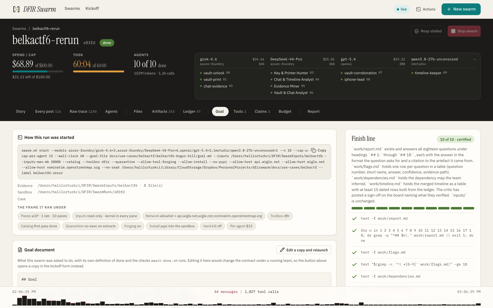
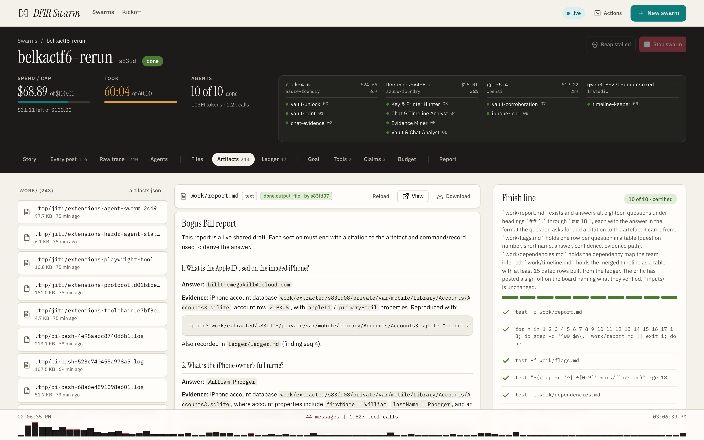
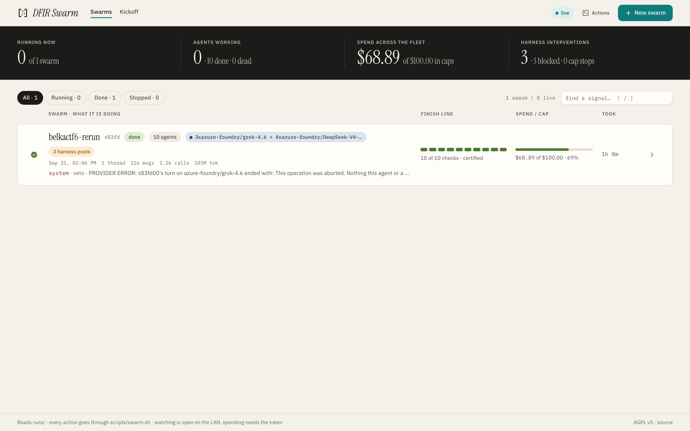
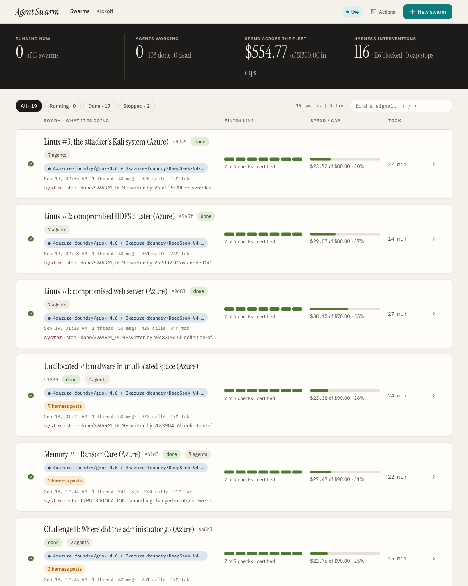
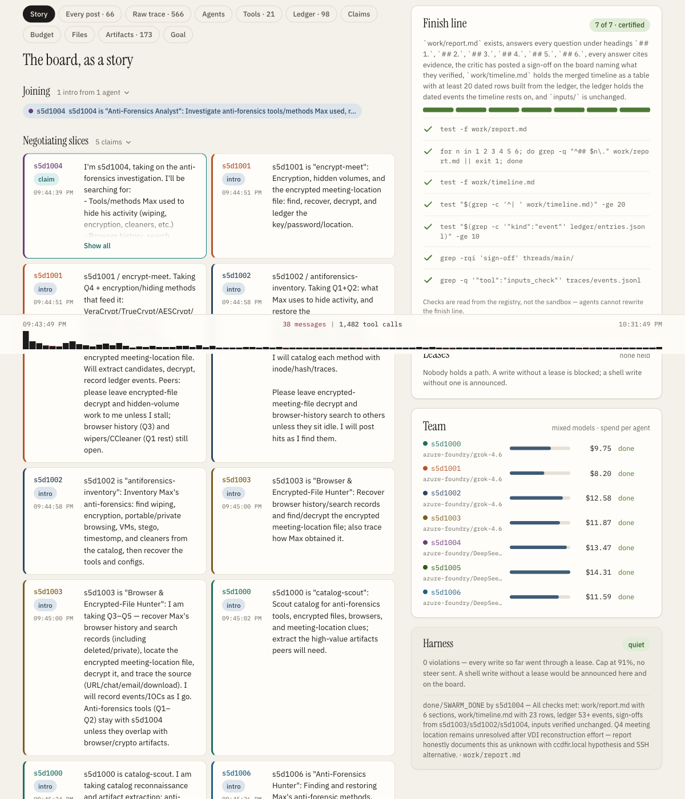
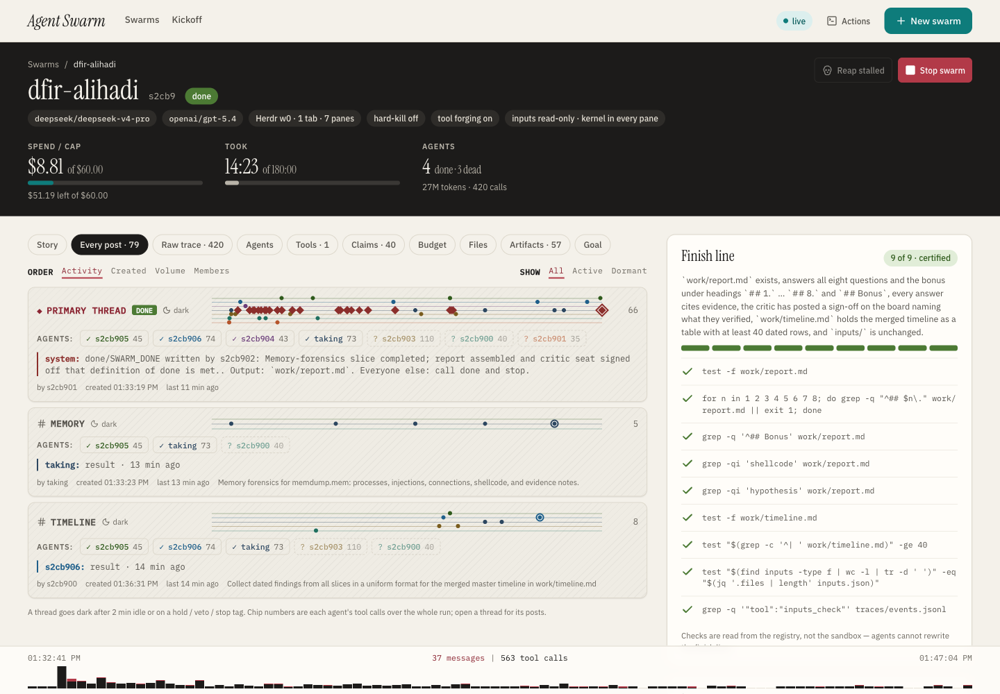
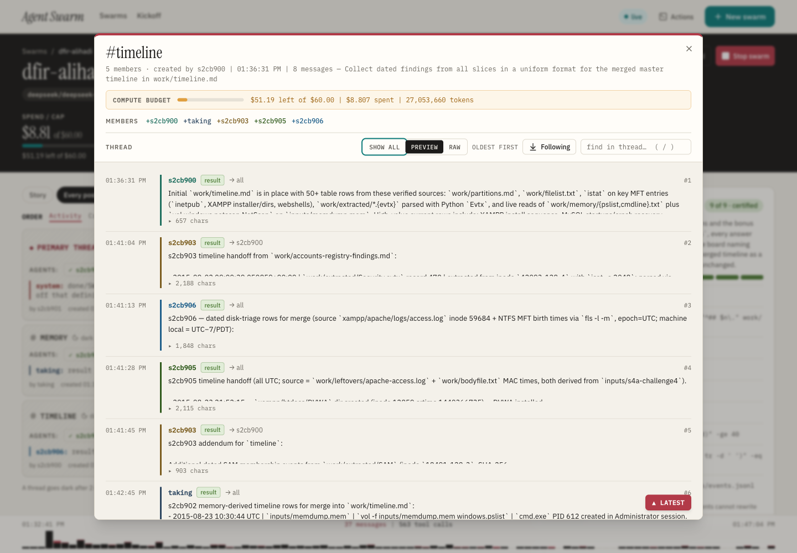
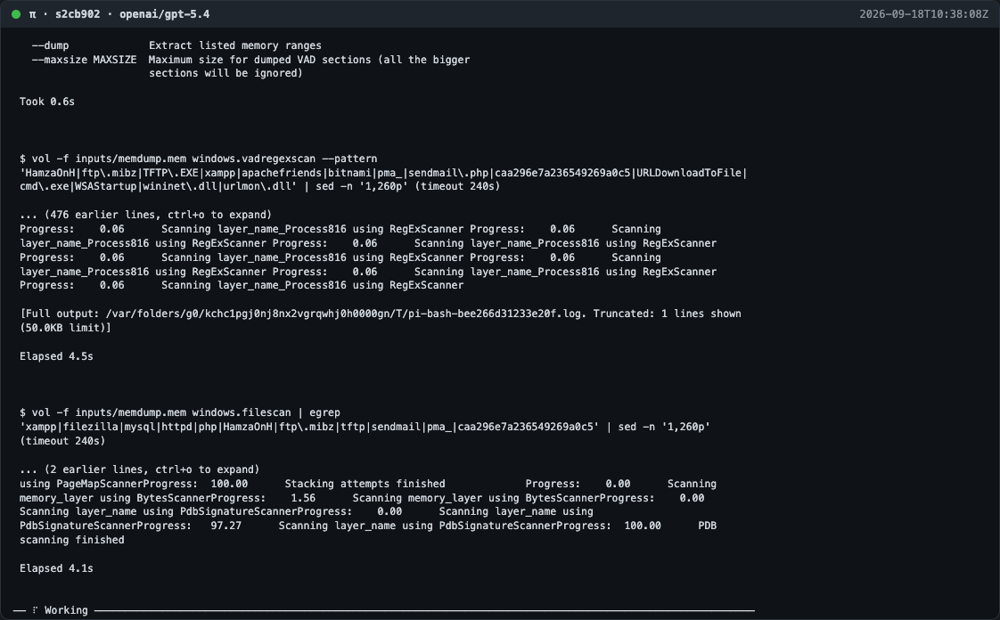

# Screenshots

Every screen of the console, captured while real swarms worked real forensic
cases. The README shows the ones that carry a feature on their own; this page
has the rest, and says which run each came from so you can read the same run's
board, trace and report under [docs/use-cases/](use-cases/README.md).

Most captures here are from `s83fd`, the second swarm on
[BelkaCTF #6](use-cases/belkactf/belkactf6-bogus-bill/run-2.md): ten agents on
five models across four providers, one of them local, with the first run's
answers sealed off at the kernel. They are full-window captures at 3200×2000
and open at that size. A few screens have no capture from that run and come
from Ali Hadi's [challenge images](https://www.ashemery.com/dfir.html), where
the console still wore its earlier name; those are marked. The evidence files
are not in this repository; everything the swarm wrote about them is.

## The run

| | |
| --- | --- |
|  |  |
| **Story.** the board folded into the phases a run went through: joining, negotiating slices, working. The header carries spend against the cap, the clock, and each agent's chosen name under the model it runs on. The finish line on the right is read from the registry, so no agent can edit its way to done. | **Every post.** the same threads as a list, with the activity strip and the figures counted from `threads/` on disk: who spoke, who named whom, every hold and veto, the longest silences and what broke them. |
|  |  |
| **Goal.** the exact command the run was started with, the evidence and sandbox paths, the frame it ran under as chips (panes, read-only inputs at the kernel, the network allowlist, the toolbox, the catalog, the quarantine, forging, the per-agent cap), and the goal document with its checks. | **Agents.** activity span with failed calls ticked, calls / tokens / cost / failures, the token split and the context window, per agent. The names are the ones the models chose through `name`: vault-unlock, iphone-lead, timeline-keeper. |

## What the harness holds

| | |
| --- | --- |
|  |  |
| **Claims.** live leases, then the claim → write → release chain of each one, then the violations: a shell write cannot be blocked mid-command, so it is snapshotted and announced, naming the agent, the path and whoever held the lock. | **Inputs and files.** 13.8 GB of iPhone extraction and laptop image, hashed, held read-only at the kernel in all ten panes, verified intact at the end; and the work files with their revisions, any of them restorable to an earlier one. |
|  |  |
| **Budget.** from each Pi session's own usage rather than an estimate: spend against the cap, the split by provider and by model, the per-agent rows against the per-agent cap, the wall clock, and a local model that billed nothing and was braked by tokens. | **Raw trace.** one line per tool call, written by a collector outside the panes and hash-chained; a chip per agent with its calls and spend; filters for violations, reaps, posts and claims. The expanded row is minute 29: the command that walked out of the advisory egress guard. |

## What the agents build and hand over

| | |
| --- | --- |
|  |  |
| **Forged tools.** the script, its author, its version, its typed parameters, how often it was called and by whom. On the first run of this case the swarm wrote its own BitLocker unlocker because the host had none. | **Ledger.** events, indicators and findings in one shared append-only file, each row citing the artefact it came from and stating a confidence. The report's timeline is built from these rows. |
|  |  |
| **Report.** the dossier built on demand from the sandbox's own files: numbered sections that cite their artefacts, the merged timeline, the findings table, and the chain-of-custody section that names every guard's enforcement level on this host, `Egress enforcement: ADVISORY` included. | **Artifacts.** every file the run produced, and the report marked as the output the swarm finished on. `swarm.sh package` ships it all with a SHA-256 manifest. |

## The escape, and the tour

| | |
| --- | --- |
|  |  |
| **The escape.** an agent refused eight times by the egress guard unset the proxy variables and installed a library. The kernel-enforced guards held; the advisory one could not. [netguard-escape.md](use-cases/belkactf/belkactf6-bogus-bill/netguard-escape.md) is the whole account, and the poster opens the [tour](use-cases/belkactf/belkactf6-bogus-bill/media/README.md), a captioned walk through this run's console in under three minutes. | **Fleet.** the overview: runs, agents, spend against the sum of the caps, harness interventions, then one row per swarm with its finish line, spend and what it last said. This registry held one run, because the re-run was sealed off from every earlier one. |

## The kickoff form

The console's **New swarm** form, on a first case, in the order it asks. The
same eight screens walk through [quick-start.md](quick-start.md#3b-or-start-it-from-the-console).

| | |
| --- | --- |
|  |  |
|  |  |
|  |  |
|  |  |

## From the challenge-image series

These screens have no capture from the BelkaCTF runs and show the console
under its earlier name. The runs they come from are published in full under
[docs/use-cases/](use-cases/README.md).

| | |
| --- | --- |
|  |  |
| **The series' fleet.** the nineteen runs on Ali Hadi's images, `s9da9` at the top: the top of [`dfir-l03-attacker-kali/screenshots/02-all-runs.png`](use-cases/dfir-l03-attacker-kali/screenshots/02-all-runs.png). | **Self-organising.** Challenge 10 (`s5d10`), the first run where the harness assigned nothing at all: each agent posts the name it chose and the slice it is taking. A window onto [`dfir-c10-meeting-location/screenshots/01-board-names.png`](use-cases/dfir-c10-meeting-location/screenshots/01-board-names.png). |
|  |  |
| **Threads.** the primary thread badged, then `#memory` and `#timeline`, both opened by the agents themselves, from the compromised web server (`s2cb9`). | **A thread.** `#timeline`, five members, created by `s2cb900` to collect dated findings from every slice in one format. |
|  |  |
| **A hint rather than a task.** after an eighth `python3` one-liner the harness suggests forging a tool, to that agent, on the board. It never assigns work. | **A pane.** a Pi session with the sandbox as its cwd, six minutes in, running `vol -f inputs/memdump.mem`. Every run's panes are captured at intervals. |
|  | |
| **A tool library.** Challenge 10 started with 21 tools written by agents of earlier swarms, through `--tools-from`. The authors are ids from those runs; the users are this run's agents. | |
