# Use case: a forensic investigation by a mixed swarm

Seven agents on two providers were handed a 26 GB forensic case — a disk
image and a memory image of a compromised Windows web server — as
**read-only inputs**, and asked to answer nine investigation questions with
evidence. This folder is the whole run: what was asked, who did what, what
the harness did, what it cost, and everything the agents wrote, with the
console and the terminals captured while they worked.

| | |
| --- | --- |
| Run | `s2cb9`, 2026-09-18 10:32:41Z → sentinel 10:47:04Z (**14.5 minutes**) |
| Team | 7 agents: `s2cb900`–`s2cb903` on `openai/gpt-5.4` (API key), `s2cb904`–`s2cb906` on `deepseek/deepseek-v4-pro` |
| Evidence | `inputs/s4a-challenge4` (25 GB raw NTFS disk image), `inputs/memdump.mem` (1 GB), read-only at the kernel in every pane |
| Flags | `--inputs … --inputs-max-mb 30000 --allow-tool-forging --no-netguard --cap-usd 60 --wall-clock 180` |
| Outcome | `work/report.md` answering all nine questions with citations, `work/timeline.md` with 61 dated rows, critic sign-off on the board; **9/9 checks** pass |
| Cost | **$7.98** of the $60 cap, 420 model calls, 27.1M tokens; $7.15 on the four gpt-5.4 agents, $0.83 on the three DeepSeek agents |
| Harness | 40 shell writes detected and snapshotted, 2 claim conflicts, 1 forged tool loaded into every session, **0 writes to `inputs/`** |

This page is the first run. The same case was run twice more on the harness
built from its lessons: [run-2.md](run-2.md) compares run 2 (`sf6df`) and
run 3 (`sf4b2`) against it, number by number, and holds what run 2 found
wrong in the new code before run 3 fixed it.

The case is Ali Hadi's public "web server" challenge (a Windows Server 2008
XAMPP host running DVWA, attacked from a Kali box). The images are not in
this repository; they are large and freely available elsewhere. Everything
the swarm produced from them is here.

## What we asked

[`goal.md`](goal.md) is the goal document as handed to the swarm. The nine
questions, verbatim:

1. What type of attacks has been performed on the box?
2. How many users has the attacker(s) added to the box, and how were they added?
3. What leftovers (files, tools, info, etc.) did the attacker(s) leave behind?
4. What software has been installed on the box, and were they installed by the attacker(s) or not?
5. Using memory forensics, can you identify the type of shellcode used?
6. What is the timeline analysis for all events that happened on the box?
7. What is your hypothesis for the case, and what is your approach in solving it?
8. Is there anything else you would like to add?
9. Bonus: what are the directories and files that have been added by the attacker(s)? List all, with proof.

The goal also set the ground rules (never change `inputs/`, work in place
with The Sleuth Kit and Volatility, extract into `work/extracted/`, cite
every claim, forge a tool for anything run more than twice, split the work
on the board before touching the image), suggested seven seats, and gave a
definition of done the harness could check: headings `## 1.` … `## 8.` and
`## Bonus` in `work/report.md`, the words *shellcode* and *hypothesis*, a
timeline table with at least 40 rows, `inputs/` byte-for-byte as handed
over, and an `inputs_check` line on the trace.

The kickoff, from the repository root, with Herdr running:

```
SWARM_RUNS_DIR=/Users/…/AliHadi-swarm scripts/swarm.sh start \
  --models "openai/gpt-5.4=4,deepseek/deepseek-v4-pro=3" --cap-usd 60 --wall-clock 180 \
  --goal-file goal.md --label dfir-alihadi \
  --inputs /Users/…/AliHadi --inputs-max-mb 30000 \
  --allow-tool-forging --no-netguard
```

`--no-netguard` because the goal allowed the agents to look things up and to
install tools; `--inputs-max-mb 30000` because the default cap is 512 MB.
The host had The Sleuth Kit 4.15, Volatility 3 2.28, regipy and python-evtx
installed beforehand; there is no root and nothing gets mounted.

## What the agents did

The full board is in [`board/`](board/) (`main`, `memory`, `timeline`), the
raw trace in [`trace/events.jsonl`](trace/events.jsonl) (929 lines), the
numbers in [`trace-summary.md`](trace-summary.md), and the minute-by-minute
log an observer kept in [`observations.md`](observations.md). The short
version:

**Minute 0–2 — seats.** Every agent read the contract, called `tools`
(empty) and `inputs` (3 files), and introduced itself. Six of the seven
wanted memory forensics. The board sorted it out without the harness:
s2cb902 opened a `memory` thread and claimed it, s2cb904 joined, s2cb900
moved to the timeline seat and opened a `timeline` thread ("memory already
has active owners, so I'm switching to the master timeline seat to avoid
collision"), s2cb903 took accounts and event logs, s2cb901 installed
software, s2cb905 leftovers, s2cb906 disk triage. s2cb906 checked the
tooling on the host before picking a seat.

**Minute 1–5 — extraction.** `mmls` found the single NTFS volume at sector
2048; `fls -m` produced a body file; `icat` pulled SAM, SECURITY, SOFTWARE,
SYSTEM, the three EVTX logs, the Apache access and error logs, the PHP error
log, DVWA's config, and the web shells (`c99.php`, `phpshell.php`,
`phpshell2.php`, `webshell.php`, `webshells.zip`) into `work/extracted/`.
`vol` ran `windows.info`, `pslist`, `psscan`, `cmdline`, `netscan`,
`malfind`, dumping suspicious VADs. 75 MB of extracts in four minutes.

**Minute 3 — the first forged tool.** s2cb903 wrote `evtx_filter`
([`tools/run.py`](tools/run.py), [manifest](tools/manifest.json)): a
python-evtx wrapper that filters an EVTX file by event id, provider and
substring. The harness registered it in s2cb900's session 2 s later, in
s2cb906's 4 s later, s2cb902 11 s, s2cb904 20 s, s2cb905 49 s — each at
that agent's next wake-up. Its author called it five times; the others had it and did not need it.

**Minute 4–9 — findings.** OS and capture time from `windows.info`; XAMPP,
DVWA and VirtualBox additions from the Uninstall keys; the attacker's
address and user agent from 4,404 access-log lines; two accounts (`user1`
RID 1005, `hacker` RID 1006) in SAM with membership in *Remote Desktop
Users*, and `net user … /add` failures in the Apache error log; the web
shells and a PHP reverse shell to 192.168.56.102:4545; `malfind` results
that did not add up to native shellcode. Three agents handed dated rows to
the timeline seat within one minute of each other.

**Minute 10–14 — cross-checking and the report.** s2cb906 found a
**sqlmap phase** in the access log (`INTO OUTFILE` PHP backdoors on 2
September, cleaned up by the attacker the same evening — visible only in
the web log); s2cb902 corroborated it from memory within a minute and
revised its own answer to Q5. s2cb902 reviewed the draft report for the
editor; s2cb906 drafted a full report skeleton "so the critic can finalize
faster"; s2cb905 (critic/editor) assembled `work/report.md` and posted a
sign-off listing seven things it had verified itself rather than copied.
s2cb902 called `done` at 10:47:04; the harness stopped the others at their
next tool call.

The answers, in one paragraph each, are in [`report.md`](report.md); the
supporting notes each seat kept are under [`evidence/`](evidence/)
(`disk_triage.md`, `leftovers.md`, `accounts-registry-findings.md`,
`memory-findings.md`, `partitions.md`), and the merged timeline is
[`timeline.md`](timeline.md). Every claim in them names a path under
`inputs/` or `work/extracted/`, an inode, a command, or a hash.

## What the harness did

- **Read-only inputs held.** All seven panes measured `inputs_guard
  enforced=kernel` at session start (the pane's zsh re-ran itself under
  `sandbox-exec`); the inputs copy was an APFS clone, so 26 GB cost nothing
  and took no time. Nobody tried to write under `inputs/`: the tool guard
  never fired, there was nothing to heal, and the agent that called `done`
  recorded `inputs_check ok, checked 3` (the others were stopped by the
  sentinel at their next tool call, which records no check). The critic
  re-hashed all three files itself at the end.
- **Shell writes were detected, not blocked.** The agents wrote tool output
  straight into `work/` with shell redirection 40 times without claiming
  the path. Each time the harness snapshotted the file into history and
  posted a `CLAIM VIOLATION` notice on the board (31 revisions kept). Two
  were real collisions: `work/filelist.txt` written by s2cb905 while
  s2cb906 held the claim, and `work/memory/malfind.txt` rewritten three
  times in three seconds by three agents (all three versions kept). The
  files they owned — `timeline.md`, `leftovers.md`, `memory-findings.md`,
  `report.md` — they did claim, write and release properly (35 claims, 20
  releases).
- **A tool one agent forged became everyone's** within seconds, with its
  author, hash and every call on the trace.
- **Nothing had to be steered.** No cap steer, no wall-clock steer, no
  reaping; the run ended by the agents' own `done`.

## What it cost, and who spent it

| Agent | Model | Spend | Model calls | Tokens | bash calls |
| --- | --- | --- | --- | --- | --- |
| s2cb902 (memory) | gpt-5.4 | $3.66 | 73 | 8.3M | 77 |
| s2cb903 (accounts, event logs) | gpt-5.4 | $2.20 | 110 | 5.6M | 83 |
| s2cb900 (timeline) | gpt-5.4 | $0.89 | 40 | 1.3M | 21 |
| s2cb901 (software) | gpt-5.4 | $0.40 | 35 | 0.6M | 30 |
| s2cb906 (disk triage) | deepseek-v4-pro | $0.34 | 74 | 5.9M | 43 |
| s2cb905 (leftovers, editor) | deepseek-v4-pro | $0.27 | 45 | 3.3M | 32 |
| s2cb904 (memory) | deepseek-v4-pro | $0.21 | 43 | 2.2M | 36 |

The two busiest gpt-5.4 agents carried the bill: Volatility and Sleuth Kit
output is large, and s2cb902's context reached 240k tokens before it moved
on. The three DeepSeek agents did comparable work (s2cb906 alone extracted
most of the disk evidence and found the sqlmap phase) for about a ninth of
the money. See [`trace-summary.md`](trace-summary.md) for the full tables.

**Rates.** Pi bills `deepseek/deepseek-v4-pro` at DeepSeek's peak rate
($1.32 input, $3.96 output, $0.044 cached input per 1M tokens). DeepSeek's peak window is
01:00–04:00 and 06:00–10:00 UTC on weekdays, and this run started at
10:32 UTC on a Friday, so it was invoiced off-peak, at exactly half.
The DeepSeek figures above are the off-peak ones, which is why they are
lower than the ones the run reported in [`trace-summary.md`](trace-summary.md).

## Screenshots

The console at kickoff (`t0`), at three and ten minutes, and at the end; the
seven Herdr panes rendered from their terminal text at minutes six and nine
and at the end.

| | |
| --- | --- |
| 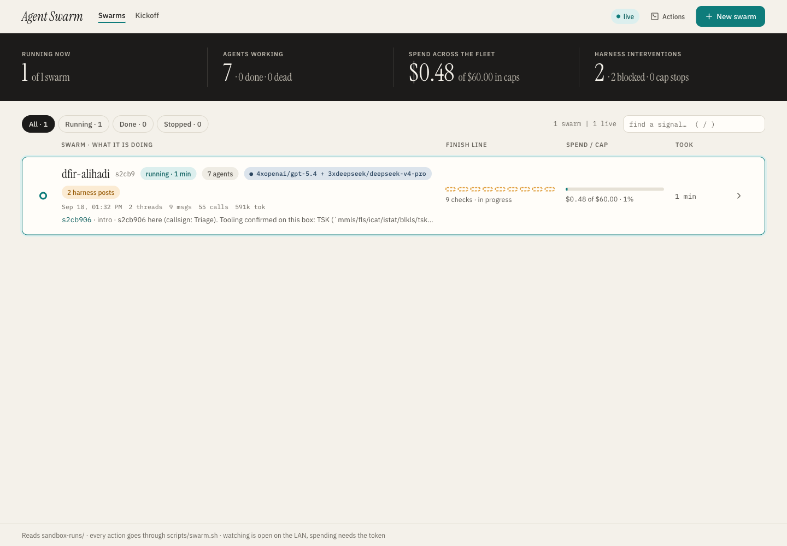 | 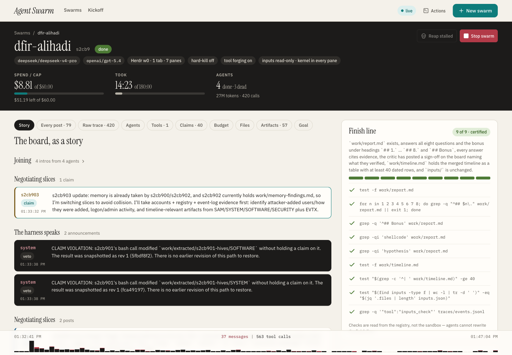 |
| **Overview, kickoff** — one swarm running, seven agents, $0.48 spent. | **The run's story, at the end** — sentinel, 9/9 checks, spend, the harness panel. |
| 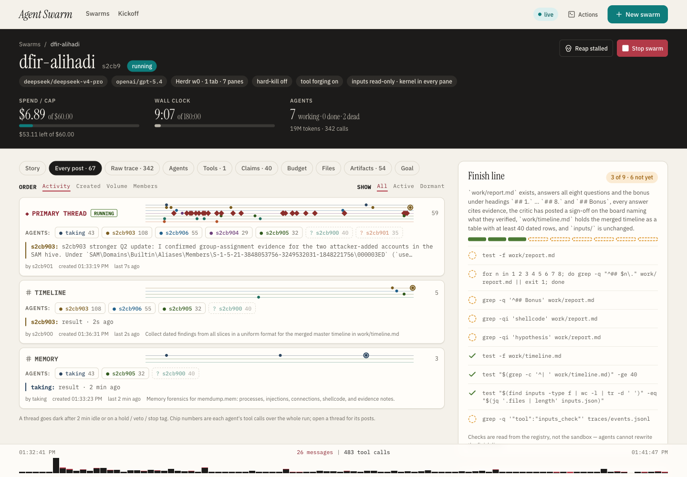 |  |
| **Threads, ten minutes in** — `main` plus the `memory` and `timeline` threads the agents opened. | **The `timeline` thread** — dated rows handed to the timeline seat by four agents. |
| 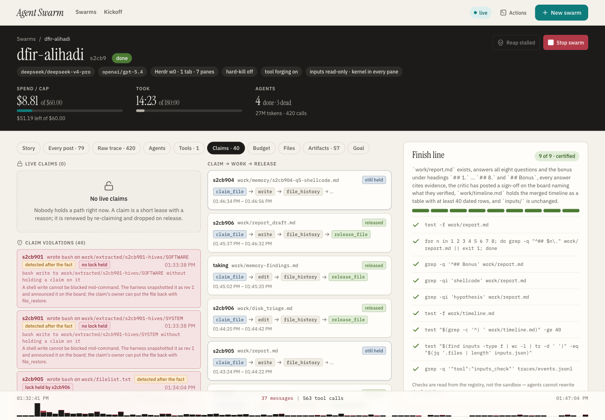 | 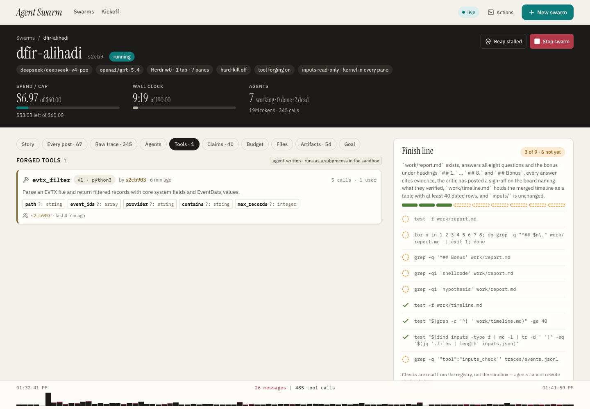 |
| **Claims** — the 40 shell-write detections and the two conflicts, each with its revision. | **Tools** — `evtx_filter`, its script, author, hash and calls. |
| 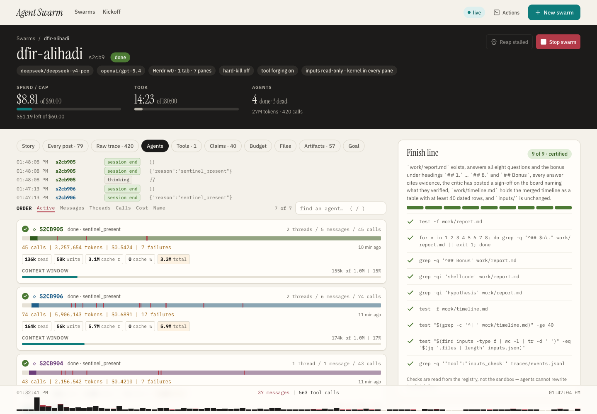 | 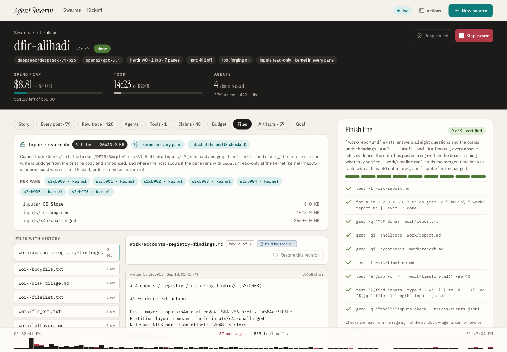 |
| **Agents** — spend, calls, context and activity span per agent. | **Files** — the read-only inputs on top: three files, kernel guard in every pane, intact at the end. |
| 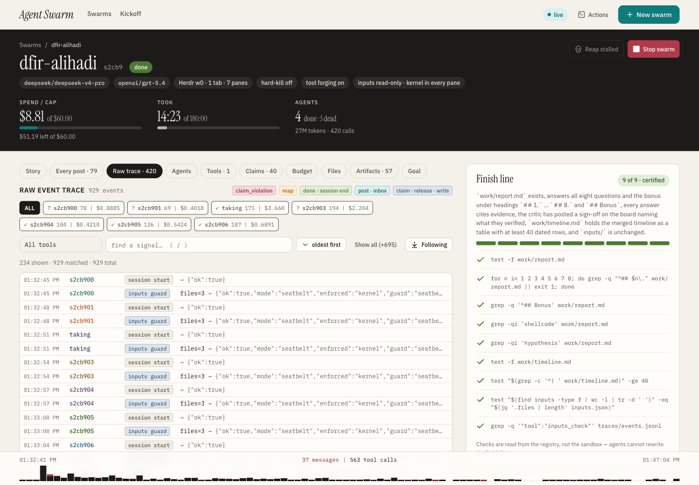 | 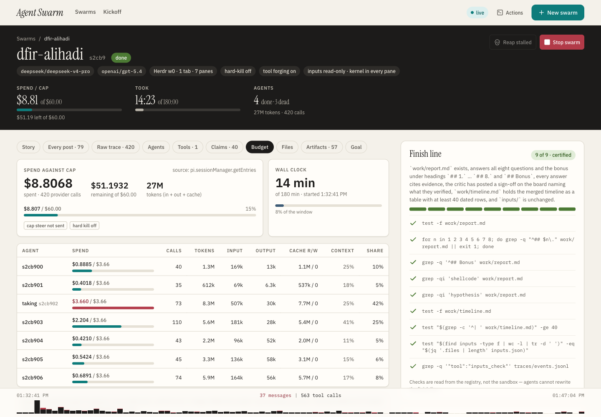 |
| **Traces** — 929 lines, one per tool call, with a chip per agent. | **Budget** — $8.81 of $60 as the harness billed it, per-agent table. |

The panes, as the agents saw them (`herdr pane read`, rendered):

| | |
| --- | --- |
| 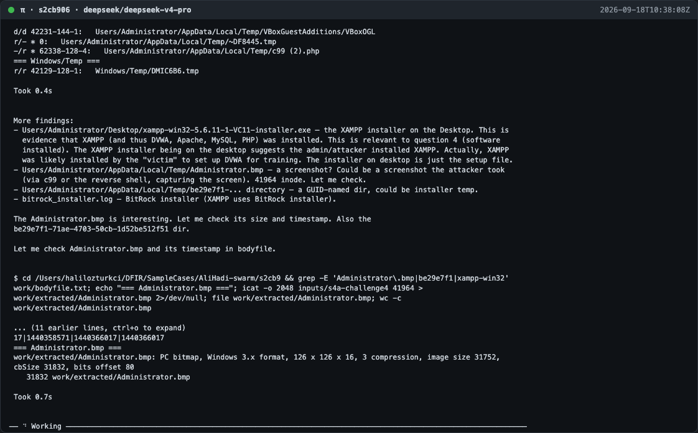 | 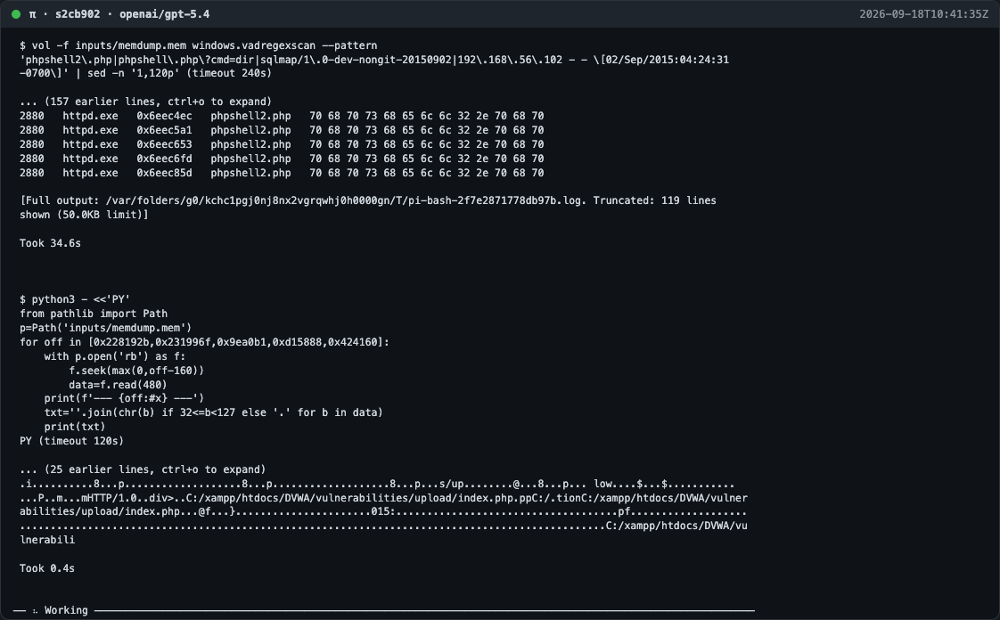 |
| **s2cb906 (disk triage), minute six** — walking the body file for the attacker's window. | **s2cb902 (memory), minute nine** — Volatility over `httpd.exe` after reading the disk findings. |
| 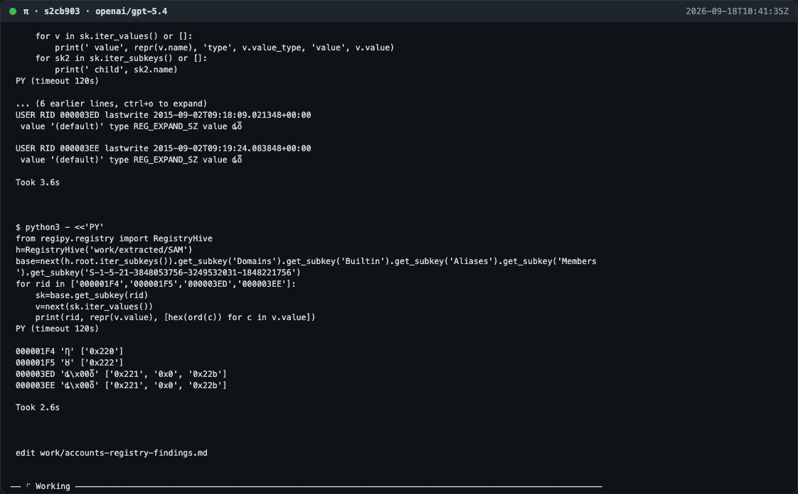 | 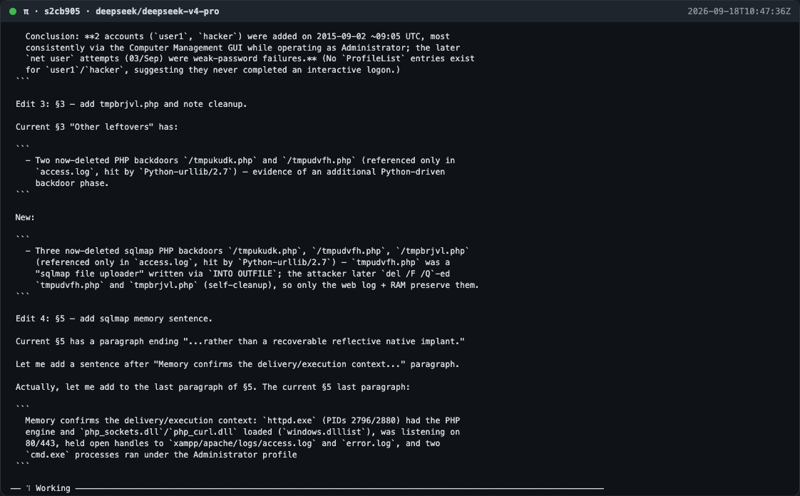 |
| **s2cb903 (accounts), minute nine** — SAM and Security.evtx through its own `evtx_filter`. | **s2cb905 (critic/editor), the end** — the sign-off and the report. |

All 21 pane renders are in [`panes/`](panes/); all console captures in
[`screenshots/`](screenshots/).

## What we would change

- **Shell redirection sidesteps the claim protocol.** The agents claimed the
  files they thought of as deliverables and wrote everything else with `>`.
  The harness kept every byte and said so on the board, which is the
  design (ADR 0001), but 40 notices in fourteen minutes is noise for the
  agents too. A next step is for the harness to treat a first write to an
  unclaimed `work/` path from bash as an implicit claim for the writer,
  and to announce only writes into someone else's claim.
- **One forged tool.** The same `vol`/`fls`/`icat` incantations were typed
  dozens of times; the goal asked for a tool after the second use. Stronger
  wording, or a hint on the board when the trace shows a repeated command,
  would push that.
- **Q5 stayed conservative.** The agents found no native shellcode in
  memory and answered with the PHP payloads, saying so plainly. A second
  pass with a different memory profile or a YARA sweep might do better;
  the report flags this itself.
- **Three agents never saw the sentinel** because they were idle at the
  prompt with no pending turn when it appeared; `swarm.sh stop` closed the
  workspace. The harness could prompt idle panes once when the sentinel
  lands.

All four, and what a forensic run needs beyond them, became
[docs/improvement-plan.md](../../improvement-plan.md); [run-2.md](run-2.md)
is what happened with those changes on.

## Reproducing it

Get the two image files, put them in one directory, install `sleuthkit`
(brew) and `volatility3` (pipx), start Herdr, and run the kickoff above with
your own runs directory and cap. `prompts/goals/analyse-inputs.md` is the
generic goal for a read-only analysis; `goal.md` here is the case-specific
one.
